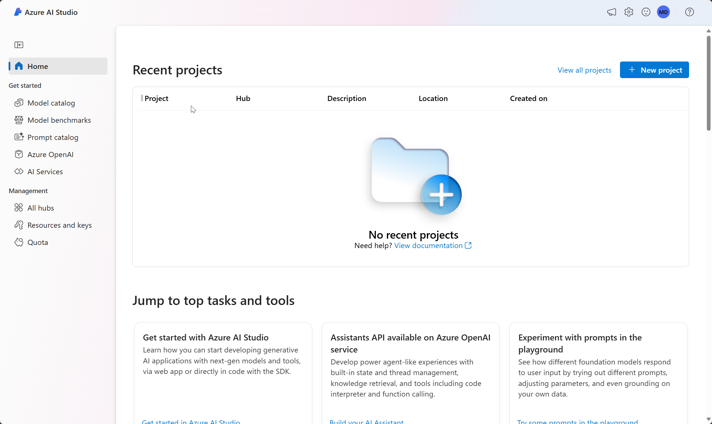
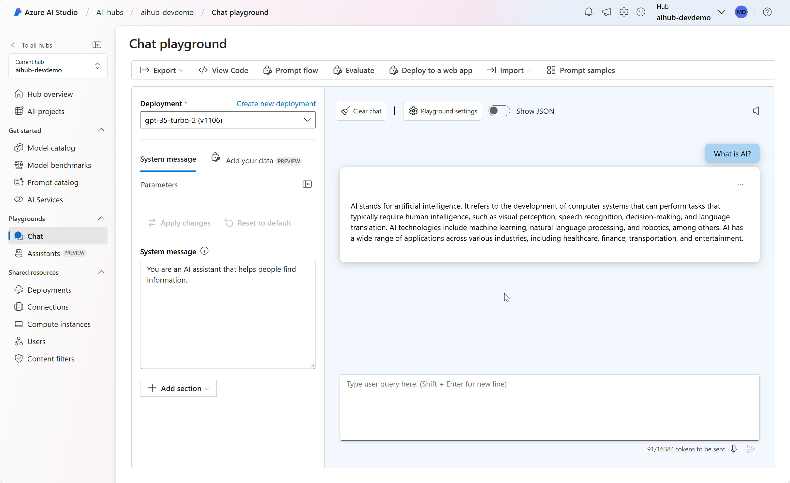

---
lab:
  title: Azure AI Foundry의 구성 요소 및 도구 탐색
---

# Azure AI Foundry의 구성 요소 및 도구 탐색

이 연습에서는 Azure AI Foundry 포털을 사용하여 프로젝트를 만들고 생성형 AI 모델을 탐색합니다.

이 연습에는 약 **30**분이 소요됩니다.

## Azure AI Foundry 포털 열기

먼저 Azure AI Foundry 포털을 탐색해 보겠습니다.

1. 웹 브라우저에서 [https://ai.azure.com](https://ai.azure.com)을(를) 열고 Azure 자격 증명을 사용하여 로그인합니다. Azure AI Foundry 포털의 홈페이지는 다음 이미지와 유사합니다.

    

1. 홈페이지의 정보를 검토하고 각 탭을 보면서 모델 및 기능을 탐색하고, 프로젝트를 만들고, 리소스를 관리하는 옵션을 확인합니다.

## Azure AI 허브 및 프로젝트 만들기

Azure AI 허브는 하나 이상의 *프로젝트*를 정의할 수 있는 공동 작업 영역을 제공합니다. 프로젝트와 Azure AI 허브를 만들어 보겠습니다.

1. 홈페이지에서 **+ 프로젝트 만들기**를 선택합니다. **프로젝트 만들기** 마법사에서는 프로젝트를 통해 자동으로 만들어지는 모든 Azure 리소스를 보거나, **만들기**를 선택하기 전에 **사용자 지정**을 선택하여 다음 설정을 사용자 지정할 수 있습니다.
   
    - **허브 이름**: *고유 이름*
    - **구독**: ‘Azure 구독’
    - **리소스 그룹**: *고유한 이름으로 새 리소스 그룹을 만들거나 기존 리소스 그룹 선택*
    - **위치**: **선택 도움말**을 선택한 다음 위치 도우미 창에서 **gpt-35-turbo**를 선택하고 추천 지역을 사용합니다.\*
    - **Azure AI 서비스 또는 Azure OpenAI 연결**: *새 AI 서비스를 만들거나 기존 서비스를 사용하도록 선택합니다*.
    - **Azure AI 검색 연결**: 연결 건너뛰기

    > \* Azure OpenAI 리소스는 지역 할당량에 따라 테넌트 수준에서 제한됩니다. 나열된 지역에는 이 연습에 사용된 모델 형식에 대한 기본 할당량이 포함되어 있습니다. 지역을 임의로 선택하면 다른 사용자와 테넌트를 공유하는 시나리오에서 단일 지역이 할당량 한도에 도달할 위험이 줄어듭니다. 연습 후반부에 할당량 한도에 도달하는 경우 다른 지역에서 다른 리소스를 만들어야 할 수도 있습니다.

1. **사용자 지정**을 선택한 경우 **다음**을 선택하고 구성을 검토합니다.
1. **만들기**를 선택하고 프로세스가 완료될 때까지 기다립니다.
   
    Azure AI 허브와 프로젝트가 만들어지면 다음 이미지와 유사하게 표시됩니다.

    

1. 새 브라우저 탭을 열고(Azure AI Foundry 포털 탭은 열어둔 상태) Azure Portal([https://portal.azure.com](https://portal.azure.com?azure-portal=true))로 이동한 뒤 메시지가 표시되면 Azure 자격 증명으로 로그인합니다.
1. Azure AI 허브를 만든 리소스 그룹으로 이동하여 생성된 Azure 리소스를 확인합니다.

    

1. Azure AI Foundry 포털 브라우저 탭으로 돌아갑니다.
1. 페이지의 왼쪽에 있는 창에서 Azure AI 허브의 각 페이지를 확인하고, 생성 및 관리할 수 있는 아티팩트를 확인합니다. **관리 센터** 페이지의 허브 또는 프로젝트 아래에서 **연결된 리소스**를 선택하여 Azure OpenAI 및 AI 서비스에 대한 연결이 이미 만들어졌는지 확인할 수 있습니다.
1. 지금 관리 센터 페이지에 있다면 **프로젝트로 이동**을 선택합니다.

## 모델 배포 및 테스트

프로젝트를 사용하여 생성 AI 모델을 기반으로 복잡한 AI 솔루션을 만들 수 있습니다. Azure AI Foundry 포털에서 사용할 수 있는 모든 개발 옵션을 전체적으로 살펴보는 것은 이 연습의 범위를 벗어나지만, 프로젝트에서 모델로 작업할 수 있는 몇 가지 기본적인 방법을 살펴보겠습니다.

1. 프로젝트 왼쪽 창의 **내 자산** 섹션에서 **모델 + 엔드포인트** 페이지를 선택합니다.
1. **모델 + 엔드포인트** 페이지의 **모델 배포** 탭에서 **+ 모델 배포**를 선택합니다.
1. 목록에서 **gpt-35-turbo** 모델을 검색하고 선택한 후 확인합니다.
1. 배포 세부 정보에서 **사용자 지정**을 선택하여 다음 설정으로 모델을 배포합니다.
    - **배포 이름**: *모델 배포에 대한 고유한 이름*
    - **배포 유형**: 표준
    - **모델 버전**: *기본 버전 선택*
    - **AI 리소스**: *이전에 만든 리소스 선택*
    - **분당 토큰 속도 제한(천 )**: 5K
    - **콘텐츠 필터**: DefaultV2
    - **동적 할당량 사용**: 사용할 수 없음
      
    > **참고**: TPM을 줄이면 사용 중인 구독에서 사용 가능한 할당량을 과도하게 사용하지 않을 수 있습니다. 이 연습에 사용된 데이터는 5,000TPM이면 충분합니다.

1. 모델이 배포된 후 배포 개요 페이지에서 **플레이그라운드에서 열기**를 선택합니다.
1. **채팅 플레이그라운드** 페이지의 **배포** 섹션에서 모델 배포가 선택되어 있는지 확인합니다.
1. 채팅창에 *AI란 무엇인가요?* 와 같은 쿼리를 입력하고 응답을 확인합니다.

    

## 정리

Azure AI Foundry 포털 탐색을 완료한 경우 불필요한 Azure 비용이 발생하지 않도록 이 연습에서 만든 리소스를 삭제해야 합니다.

1. Azure Portal이 포함된 브라우저 탭으로 돌아가서(또는 새 브라우저 탭에서 [Azure Portal](https://portal.azure.com?azure-portal=true)을 다시 열고) 이 연습에 사용된 리소스를 배포한 리소스 그룹의 콘텐츠를 확인합니다.
1. 도구 모음에서 **리소스 그룹 삭제**를 선택합니다.
1. 리소스 그룹 이름을 입력하고 삭제할 것인지 확인합니다.
