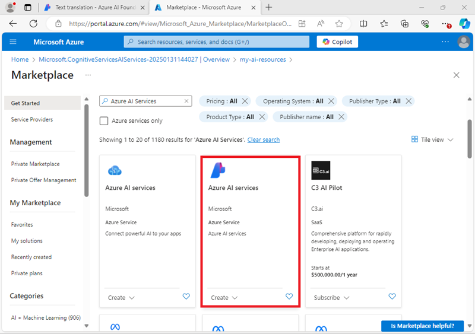

---
lab:
  title: AI 개발 프로젝트 준비
  description: 개발자가 AI 솔루션을 빌드할 때 성공하도록 설정되도록 허브 및 프로젝트에서 클라우드 리소스를 구성하는 방법을 알아봅니다.
---

# AI 개발 프로젝트 준비

이 연습에서는 Azure AI 파운드리 포털을 사용하여 개발자 팀이 AI 솔루션을 빌드할 준비가 된 허브 및 프로젝트를 만듭니다.

이 연습에는 약 **30**분이 소요됩니다.

## Azure AI Foundry 포털 열기

Azure AI 파운드리 포털에 로그인하여 시작해 보겠습니다.

1. 웹 브라우저에서 [Azure AI 파운드리 포털](https://ai.azure.com)(`https://ai.azure.com`)을 열고 Azure 자격 증명을 사용하여 로그인합니다. 처음 로그인할 때 열리는 팁이나 빠른 시작 창을 닫고, 필요한 경우 왼쪽 위에 있는 **Azure AI 파운드리** 로고를 사용하여 다음 이미지(**도움말** 창이 열려 있는 경우 닫습니다)와 유사한 홈페이지로 이동합니다.

    

1. 홈페이지의 정보를 리뷰합니다.

## 허브 및 프로젝트 만들기

Azure AI *허브*는 하나 이상의 *프로젝트*를 정의할 수 있는 공동 작업 영역을 제공합니다. 프로젝트 및 Azure AI 허브를 만들고 이를 지원하기 위해 만든 Azure 리소스를 검토해 보겠습니다.

1. 홈페이지에서 **+ 프로젝트 만들기**를 선택합니다.
1. **프로젝트 만들기** 마법사에서 유효한 프로젝트 이름을 입력하고 기존 허브가 추천되면 새 허브를 만드는 옵션을 선택합니다. 그런 다음 허브 및 프로젝트를 지원하기 위해 자동으로 만들어지는 Azure 리소스를 검토합니다.
1. **사용자 지정**을 선택하고 허브에 대해 다음 설정을 지정합니다.
    - **허브 이름**: *허브에서 유효한 이름*
    - **구독**: ‘Azure 구독’
    - **리소스 그룹**: ‘리소스 그룹 만들기 또는 선택’
    - **위치**: **선택 도움말**을 선택한 다음 위치 도우미 창에서 **gpt-4**를 선택하고 권장되는 지역을 사용합니다.\*
    - **Azure AI 서비스 또는 Azure OpenAI** 연결: *새 AI 서비스 리소스 만들기*
    - **Azure AI 검색 연결**: 연결 건너뛰기

    > \* Azure OpenAI 리소스는 지역 모델에 따라 제한됩니다. 연습 후반부에 할당량 한도를 초과하는 경우 다른 지역에서 다른 리소스를 만들어야 할 수도 있습니다.

1. **다음**을 선택하여 구성을 검토합니다. **만들기**를 선택하고 프로세스가 완료될 때까지 기다립니다.
1. 프로젝트를 만들 때 표시되는 팁을 모두 닫고 Azure AI 파운드리 포털에서 프로젝트 페이지를 검토합니다. 이 페이지는 다음 이미지와 유사합니다.

    

1. 왼쪽 탐색 창 아래에서 **관리 센터**를 선택합니다. 관리 센터에서 *허브* 및 *프로젝트* 수준 모두에서 설정을 구성할 수 있습니다. 둘 다 탐색 창에 표시됩니다.

    

    탐색 창에서 다음 페이지에서 허브 및 프로젝트 수준 자산을 보고 관리할 수 있습니다.

    - 개요
    - 사용자
    - 모델 및 엔드포인트
    - 연결된 리소스
    - 컴퓨팅(*허브 수준만* 해당)

    > **참고**: Azure 테넌트에서 Entra ID에 할당된 사용 권한에 따라 허브 수준에서 리소스를 관리하지 못할 수 있습니다.

1. 탐색 창의 허브 섹션에 있는 **개요** 페이지를 선택하여 허브의 세부 정보를 봅니다. 
1. **허브 속성** 창에서 허브와 연결된 리소스 그룹 링크를 선택하여 새 브라우저 탭을 열고 Azure Portal로 이동합니다. 메시지가 표시되면 Azure 자격 증명을 사용하여 로그인합니다.
1. Azure Portal에서 리소스 그룹을 확인하여 허브 및 프로젝트를 지원하기 위해 만들어진 Azure 리소스를 확인합니다.

    

    리소스는 허브를 만들 때 선택한 지역에 만들어졌습니다.

## 연결된 리소스 추가

프로젝트가 다른 지역의 두 번째 **Azure AI Services** 리소스에 액세스해야 한다고 가정합니다.

1. Azure Portal의 리소스 그룹 페이지에서 **+ 만들기**를 선택하고 `Azure AI Services`를 검색합니다. 결과에서 다음 이미지와 같이 **Azure AI Services** 다중 서비스 리소스를 선택합니다.

    

1. 그런 다음, 다음 설정을 사용하여 새 **Azure AI 서비스** 리소스를 만듭니다.
    - **구독**: ‘Azure 구독’
    - **리소스 그룹**: *Azure AI 파운드리 리소스가 포함된 리소스 그룹을 선택합니다*.
    - **지역**: *기존 리소스를 포함하는 지역 이외의 사용 가능한 지역 선택*
    - **이름**: *두 번째 Azure AI 서비스 리소스에 적합한 이름 중 하나*
    - **가격 책정 계층**: 표준 S0
1. AI, 서비스 리소스가 생성될 때까지 기다립니다.
1. Azure AI 파운드리 포털 브라우저 탭으로 돌아가서 **관리 센터** 보기의 탐색 창에서 *<u>프로젝트</u>* 섹션에서 **연결된 리소스** 페이지를 봅니다. 프로젝트의 기존 연결된 리소스가 나열됩니다.

    

1. **+ 새 연결**을 선택하고 **Azure AI 서비스** 리소스 유형을 선택합니다. 그런 다음 사용 가능한 리소스를 찾아서 Azure Portal에서 만든 AI Services 리소스를 찾고 **연결 추가** 단추를 사용하여 프로젝트에 추가합니다.

    

1. 새 리소스가 연결되면 **Azure AI 서비스 리소스 연결** 대화 상자를 닫 고 Azure AI 서비스 및 Azure OpenAI Service에 새로 연결된 리소스가 나열되는지 확인합니다.

## AI 서비스 탐색

Azure AI 파운드리 프로젝트에는 Azure AI 서비스에 액세스할 수 있습니다. 포털에서 사용해 보겠습니다.

1. 관리 센터 페이지의 탐색 창에서 프로젝트 아래에서 **프로젝트로 이동**을 선택합니다.
1. 프로젝트의 탐색 창에서 **AI 서비스**를 선택하고 **언어 및 번역기** 타일을 선택합니다.

    

1. **언어 기능 탐색** 섹션에서 **번역** 탭을 확인하고 **텍스트 번역**을 선택합니다.

    

1. **텍스트 번역** 페이지의 **실행 시도** 섹션에서 **사용자 고유의 탭으로 시도** 탭을 봅니다.
1. Azure AI 서비스 리소스 중 하나를 선택한 다음, 일부 텍스트(예: `Hello world`)를 한 언어에서 다른 언어로 번역해 봅니다.

    

## 생성형 AI 모델 배포 및 테스트

프로젝트에는 Azure OpenAI 언어 모델을 사용하여 생성 AI 솔루션을 구현할 수 있는 Azure OpenAI에 대한 연결된 리소스도 포함되어 있습니다. 모델 카탈로그에서 다른 공급업체의 생성형 AI 모델을 찾아 사용할 수도 있습니다.

1. 프로젝트 왼쪽 창의 **내 자산** 섹션에서 **모델 + 엔드포인트** 페이지를 선택합니다.
1. **모델 + 엔드포인트** 페이지의 **모델 배포** 탭의 **+ 모델 배포** 메뉴에서 **기본 모델 배포**를 선택합니다.
1. 목록에서 **gpt-4o** 모델을 검색하고 선택한 후 확인합니다.
1. 배포 세부 정보에서 **사용자 지정**을 선택하여 다음 설정으로 모델을 배포합니다.
    - **배포 이름**: *모델 배포에 대한 고유한 이름*
    - **배포 유형**: 글로벌 표준
    - **자동 버전 업데이트**: 사용
    - **모델 버전**: *사용 가능한 최신 버전 선택*
    - **연결된 AI 리소스**: *Azure OpenAI 리소스 연결 선택*
    - **분당 토큰 속도 제한(천 단위)**: 50K *(또는 50K 이하인 경우 구독에서 사용 가능한 최대치)*
    - **콘텐츠 필터**: DefaultV2

    > **참고**: TPM을 줄이면 사용 중인 구독에서 사용 가능한 할당량을 과도하게 사용하지 않을 수 있습니다. 이 연습에 사용되는 데이터는 50,000TPM이면 충분합니다. 사용 가능한 할당량이 이 수치 이하이면 연습을 완료할 수 있지만 속도 제한을 초과하는 경우 오류가 발생할 수 있습니다.

1. 배포가 완료될 때가지 기다립니다.

1. 모델이 배포된 후 배포 개요 페이지에서 **플레이그라운드에서 열기**를 선택합니다.
1. **채팅 플레이그라운드** 페이지의 **배포** 섹션에서 모델 배포가 선택되어 있는지 확인합니다.
1. **설치** 창의 **모델 지침 컨텍스트 제공** 입력란에 다음 지침을 입력합니다.

    ```
    You are a history teacher who can answer questions about past events all around the world.
    ```

1. 시스템 메시지에 업데이트한 변경 내용을 적용합니다.
1. 채팅창에 `What are the key events in the history of Scotland?`와 같은 쿼리를 입력하고 응답을 확인합니다.

    

## 요약

이 연습에서는 Azure AI 파운드리를 살펴보았으며, Azure AI 파운드리 포털에서 허브 및 프로젝트를 만들고 관리하고, 연결된 리소스를 추가하고, Azure AI 서비스 및 Azure OpenAI 모델을 탐색하는 방법을 알아보았습니다.

## 정리

Azure AI Foundry 포털 탐색을 완료한 경우 불필요한 Azure 비용이 발생하지 않도록 이 연습에서 만든 리소스를 삭제해야 합니다.

1. Azure Portal이 포함된 브라우저 탭으로 돌아가서(또는 새 브라우저 탭의 `https://portal.azure.com`에서 [Azure Portal](https://portal.azure.com)을 다시 열고) 이 연습에 사용된 리소스를 배포한 리소스 그룹의 콘텐츠를 확인합니다.
1. 도구 모음에서 **리소스 그룹 삭제**를 선택합니다.
1. 리소스 그룹 이름을 입력하고 삭제할 것인지 확인합니다.
