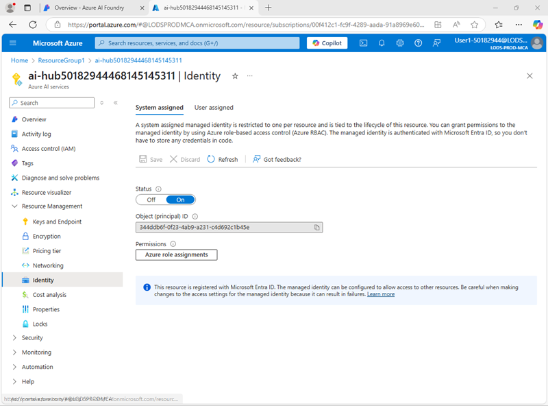

---
lab:
  title: 프롬프트 흐름을 사용하여 채팅 앱에서 대화 관리
  description: 프롬프트 흐름을 사용하여 대화형 대화 상자를 관리하고 최상의 결과를 위해 프롬프트가 생성되고 오케스트레이션되는지 확인하는 방법을 알아봅니다.
---

## 프롬프트 흐름을 사용하여 채팅 앱에서 대화 관리

이 연습에서는 Azure AI 파운드리 포털의 프롬프트 흐름을 사용하여 사용자 프롬프트와 채팅 기록을 입력으로 사용하고 Azure OpenAI의 GPT 모델을 사용하여 출력을 생성하는 사용자 지정 채팅 앱을 만들어 보겠습니다.

이 연습은 약 **30**분 정도 소요됩니다.

> **참고**: 이 연습에 사용된 일부 기술은 미리 보기이거나 현재 개발 중에 있습니다. 예기치 않은 동작, 경고 또는 오류가 발생할 수 있습니다.

## Azure AI 파운드리 허브 및 프로젝트 만들기

이 연습에서 사용할 Azure AI 파운드리의 기능에는 Azure AI 파운드리 *허브* 리소스를 기반으로 하는 프로젝트가 필요합니다.

1. 웹 브라우저에서 [Azure AI 파운드리 포털](https://ai.azure.com)(`https://ai.azure.com`)을 열고 Azure 자격 증명을 사용하여 로그인합니다. 처음 로그인할 때 열리는 팁이나 빠른 시작 창을 닫고, 필요한 경우 왼쪽 위에 있는 **Azure AI 파운드리** 로고를 사용하여 다음 이미지와 유사한 홈페이지로 이동합니다(**도움말** 창이 열려 있는 경우 닫습니다).

    

1. 브라우저에서 `https://ai.azure.com/managementCenter/allResources`로 이동하여 **새로 만들기**를 선택합니다. 그런 다음 새 **AI 허브 리소스**를 만드는 옵션을 선택합니다.
1. **프로젝트 만들기** 마법사에서 유효한 프로젝트 이름을 입력하고 새 허브를 만드는 옵션을 선택합니다. 그런 다음 **허브 이름 바꾸기** 링크를 사용하여 새 허브의 유효한 이름을 지정하고 **고급 옵션**을 확장한 후 프로젝트에 대해 다음 설정을 지정합니다.
    - **구독**: ‘Azure 구독’
    - **리소스 그룹**: ‘리소스 그룹 만들기 또는 선택’
    - **지역**:  미국 동부 2 또는 스웨덴 중부(*연습 후반부에 할당량 한도를 초과하는 경우 다른 지역에서 다른 리소스를 만들어야 할 수도 있습니다.*)

    > **참고**: 허용 가능한 리소스 이름을 제한하기 위해 정책을 사용하는 Azure 구독에서 작업하는 경우 **새 프로젝트 만들기** 대화 상자 아래 있는 링크를 사용하여 Azure Portal을 통해 허브를 만들어야 할 수도 있습니다.

    > **팁**: **만들기** 단추가 여전히 사용하지 않도록 설정된 경우 허브 이름을 고유한 영숫자 값으로 바꿔야 합니다.

1. 프로젝트가 만들어질 때까지 기다립니다.

## 리소스 권한 부여 구성

Azure AI 파운드리의 프롬프트 흐름 도구는 Blob Storage 내 폴더에 프롬프트 흐름을 정의하는 파일 기반 자산을 만듭니다. 프롬프트 흐름을 탐색하기 전에 Azure AI 파운드리 리소스가 BLOb 저장소에 필요한 액세스 권한이 있는지 확인하여 해당 데이터를 읽을 수 있도록 합니다.

1. 새 브라우저 탭에서 [Azure Portal](https://portal.azure.com)(`https://portal.azure.com`)을 열고 메시지가 표시되면 Azure 자격 증명으로 로그인하고, Azure AI 허브 리소스가 포함된 리소스 그룹을 확인합니다.
1. 허브의 **Azure AI 파운드리** 리소스를 선택하여 엽니다. 그런 다음 **리소스 관리** 섹션을 확장하고 **ID** 페이지를 선택합니다.

    

1. 시스템 할당 ID의 상태가 **Off**이면 **On**으로 전환하고 변경 내용을 저장합니다. 그런 다음 상태 변경이 확인될 때까지 기다립니다.
1. 리소스 그룹 페이지로 돌아가 허브에 대한 **스토리지 계정** 리소스를 선택하고 해당 **IAM(액세스 제어)** 페이지를 확인합니다.

    

1. Azure AI Foundry 프로젝트 리소스에서 사용하는 관리 ID의 `Storage blob data reader` 역할에 역할 할당을 추가합니다.

    

1. Azure AI 파운드리 관리 ID가 스토리지 계정의 Blob을 읽을 수 있도록 역할 액세스를 검토하고 할당했다면 Azure Portal 탭을 닫고 Azure AI 파운드리 포털로 돌아갑니다.

## 생성형 AI 모델 배포

이제 프롬프트 흐름 애플리케이션을 지원하기 위해 생성형 AI 언어 모델을 배포할 준비가 되었습니다.

1. 프로젝트 왼쪽 창의 **내 자산** 섹션에서 **모델 + 엔드포인트** 페이지를 선택합니다.
1. **모델 + 엔드포인트** 페이지의 **모델 배포** 탭의 **+ 모델 배포** 메뉴에서 **기본 모델 배포**를 선택합니다.
1. 목록에서 **gpt-4o** 모델을 검색하고 선택한 후 확인합니다.
1. 배포 세부 정보에서 **사용자 지정**을 선택하여 다음 설정으로 모델을 배포합니다.
    - **배포 이름**: *모델 배포에 대한 유효한 이름*
    - **배포 유형**: 글로벌 표준
    - **자동 버전 업데이트**: 사용
    - **모델 버전**: *사용 가능한 최신 버전 선택*
    - **연결된 AI 리소스**: *Azure OpenAI 리소스 연결 선택*
    - **분당 토큰 속도 제한(천 단위)**: 50K *(또는 50K 이하인 경우 구독에서 사용 가능한 최대치)*
    - **콘텐츠 필터**: DefaultV2

    > **참고**: TPM을 줄이면 사용 중인 구독에서 사용 가능한 할당량을 과도하게 사용하지 않을 수 있습니다. 이 연습에 사용되는 데이터는 50,000TPM이면 충분합니다. 사용 가능한 할당량이 이 수치 이하이면 연습을 완료할 수 있지만 속도 제한을 초과하는 경우 오류가 발생할 수 있습니다.

1. 배포가 완료될 때가지 기다립니다.

## 프롬프트 흐름 만들기

프롬프트 흐름은 프롬프트 및 기타 활동을 오케스트레이션하여 생성형 AI 모델과의 상호 작용을 정의하는 방법을 제공합니다. 이 연습에서는 템플릿을 사용하여 여행사의 AI 도우미에 대한 기본 채팅 흐름을 만듭니다.

1. Azure AI 파운드리 포털 탐색 모음의 **빌드 및 사용자 지정** 섹션에서 **프롬프트 흐름**을 선택합니다.
1. **채팅 흐름** 템플릿을 기반으로 새 흐름을 만들고 `Travel-Chat`을(를) 폴더 이름으로 지정합니다.

    간단한 채팅 흐름이 만들어집니다.

    > **팁**: 사용 권한 오류가 발생하는 경우 몇 분 기다렸다가 필요한 경우 다른 흐름 이름을 지정하여 다시 시도합니다.

1. 흐름을 테스트하려면 컴퓨팅이 필요하며 시작하는 데 시간이 걸릴 수 있습니다. 따라서 **컴퓨팅 세션 시작**을 선택하여 기본값 흐름을 탐색하고 수정하는 동안 시작합니다.

1. 일련의 *입력*, *출력* 및 *도구*로 구성된 프롬프트 흐름을 봅니다. 왼쪽의 편집 창에서 이러한 개체의 속성을 확장 및 편집할 수 있으며 오른쪽에서 전체 흐름을 그래프로 볼 수 있습니다.

    

1. **입력** 창에 두 개의 입력(채팅 기록 및 사용자의 질문)이 있는지 확인합니다.
1. **출력** 창에 모델의 응답을 반영하는 출력이 있는지 확인합니다.
1. 모델에 프롬프트를 제출하는 데 필요한 정보가 포함된 **채팅** LLM 도구 창을 봅니다.
1. **채팅** LLM 도구 창의 **연결**에서 AI 허브의 Azure OpenAI Service 리소스에 대한 연결을 선택합니다. 그후 다음 연결 속성을 구성합니다.
    - **API**: 채팅
    - **deployment_name**: *배포한 gpt-4o 모델*
    - **response_format**: {"type":"text"}
1. **프롬프트** 필드를 다음과 같이 수정합니다.

   ```yml
   # system:
   **Objective**: Assist users with travel-related inquiries, offering tips, advice, and recommendations as a knowledgeable travel agent.

   **Capabilities**:
   - Provide up-to-date travel information, including destinations, accommodations, transportation, and local attractions.
   - Offer personalized travel suggestions based on user preferences, budget, and travel dates.
   - Share tips on packing, safety, and navigating travel disruptions.
   - Help with itinerary planning, including optimal routes and must-see landmarks.
   - Answer common travel questions and provide solutions to potential travel issues.

   **Instructions**:
   1. Engage with the user in a friendly and professional manner, as a travel agent would.
   2. Use available resources to provide accurate and relevant travel information.
   3. Tailor responses to the user's specific travel needs and interests.
   4. Ensure recommendations are practical and consider the user's safety and comfort.
   5. Encourage the user to ask follow-up questions for further assistance.

   
   # user:
   {{item.inputs.question}}
   # assistant:
   {{item.outputs.answer}}
   

   # user:
   {{question}}
   ```

    추가한 프롬프트를 읽고 숙지합니다. 이는 시스템 메시지(목표, 기능 정의, 일부 지침 포함)와 채팅 기록(사용자의 질문 입력과 이전 도우미 응답 출력이 순서대로 표시)으로 구성됩니다.

1. **채팅** LLM 도구의 **입력** 섹션(프롬프트 아래)에서 다음 변수가 설정되어 있는지 확인합니다.
    - **질문**(문자열): ${inputs.question}
    - **chat_history** (string): ${inputs.chat_history}

1. 변경 내용을 흐름에 저장합니다.

    > **참고**: 이 연습에서는 간단한 채팅 흐름을 사용하지만 프롬프트 흐름 편집기에는 흐름에 추가할 수 있는 다른 많은 도구가 포함되어 있어 대화를 오케스트레이션하는 복잡한 로직을 만들 수 있습니다.

## 흐름 테스트

이제 흐름을 개발했으므로 채팅 창을 사용하여 흐름을 테스트할 수 있습니다.

1. 컴퓨팅 세션이 실행 중인지 확인합니다. 그렇지 않은 경우 시작할 때까지 기다립니다.
1. 도구 모음에서 **채팅**을 선택하여 **채팅** 창을 열고 채팅이 초기화되기를 기다립니다.
1. 쿼리 `I have one day in London, what should I do?`를 입력하고 출력을 검토합니다. 채팅 창은 다음과 같이 보입니다.

    

## 흐름 배포

만든 흐름의 동작에 만족하면 흐름을 배포할 수 있습니다.

> **참고**: 배포에는 시간이 오래 걸릴 수 있으며 구독 또는 테넌트의 용량 제한의 영향을 받을 수 있습니다.

1. 도구 모음에서 **배포**를 선택하여 다음 설정으로 흐름을 배포합니다.
    - **기본 설정**
        - **엔드포인트**: 새로 만들기
        - **엔드포인트 이름**: *고유 이름 입력*
        - **배포 이름**: *고유 이름 입력*
        - **가상 머신**: Standard_DS3_v2
        - **인스턴스 수**: 1
        - **추론 데이터 수집**: 사용 안 함
    - **고급 설정**:
        - *기본 설정 사용*
1. Azure AI 파운드리 포털의 탐색 창에서 **내 자산** 섹션의 **모델 + 엔드포인트** 페이지를 선택합니다.

    gpt-4o 모델에 대한 페이지가 열리면 **뒤로** 단추를 사용하여 모든 모델 및 엔드포인트를 봅니다.

1. 처음에는 페이지에 모델 배포만 표시될 수 있습니다. 배포가 나열되기까지 다소 시간이 걸릴 수 있으며, 성공적으로 생성되기까지 더 오래 걸릴 수도 있습니다.
1. 배포에 *성공*이 표시되면 해당 배포를 선택합니다. 그런 다음 해당 **테스트** 페이지를 확인합니다.

    > **팁**: 테스트 페이지에서 엔드포인트를 비정상이라고 설명하는 경우 **모델 및 엔드포인트**로 돌아가서 1분 정도 기다린 후 보기를 새로 고침하고 엔드포인트를 다시 선택합니다.

1. 프롬프트 `What is there to do in San Francisco?`를 입력하고 응답을 검토합니다.
1. 프롬프트 `Tell me something about the history of the city.`를 입력하고 응답을 검토합니다.

    테스트 창은 다음과 같이 보입니다.

    

1. 엔드포인트의 **사용** 페이지를 보고, 엔드포인트용 클라이언트 애플리케이션을 빌드하는 데 사용할 수 있는 연결 정보와 샘플 코드가 포함되어 있어 프롬프트 흐름 솔루션을 애플리케이션에 생성형 AI 애플리케이션으로 통합할 수 있다는 점에 유의하세요.

## 정리

프롬프트 흐름의 탐색을 마치면 불필요한 Azure 비용을 피하기 위해 생성한 리소스를 삭제해야 합니다.

- `https://portal.azure.com`에서 [Azure Portal](https://portal.azure.com)로 이동합니다.
- Azure Portal의 **홈** 페이지에서 **리소스 그룹**을 선택합니다.
- 이 연습을 위해 만든 리소스 그룹을 선택합니다.
- 리소스 그룹의 **개요** 페이지에서 **리소스 그룹 삭제**를 선택합니다.
- 리소스 그룹 이름을 입력하여 삭제 의사를 확인한 다음 **삭제**를 선택합니다.
