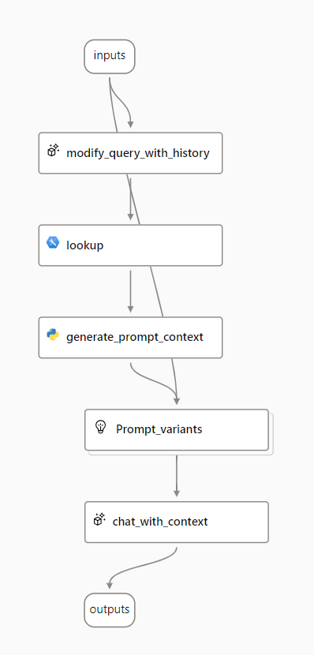

---
lab:
  title: 사용자 고유의 데이터를 사용하는 생성형 AI 앱 만들기
  description: RAG(검색 증강 생성) 모델을 사용하여 사용자 고유의 데이터로 프롬프트를 그라운딩하는 채팅 앱 빌드 방법을 알아봅니다.
---

# 사용자 고유의 데이터를 사용하는 생성형 AI 앱 만들기

RAG(검색 증강 생성)은 사용자 지정 데이터 소스의 데이터를 생성형 AI 모델에 대한 프롬프트에 통합하는 애플리케이션을 빌드하는 데 사용되는 기술입니다. RAG는 언어 모델을 사용하여 입력을 해석하고 적절한 응답을 생성하는 채팅 기반 애플리케이션인 생성형 AI 앱을 개발하는 데 일반적으로 사용되는 패턴입니다.

이 연습에서는 Azure AI Foundry 포털을 사용하여 사용자 지정 데이터를 생성형 AI 프롬프트 흐름에 통합합니다.

이 연습에는 약 **45**분이 소요됩니다.

## Azure AI 파운드리 프로젝트 만들기

먼저 Azure AI 파운드리 프로젝트 및 Azure AI 검색 리소스를 포함하여 사용자 고유의 데이터 사용을 지원하는 데 필요한 서비스 리소스를 만들어 보겠습니다.

1. 웹 브라우저에서 [Azure AI 파운드리 포털](https://ai.azure.com)(`https://ai.azure.com`)을 열고 Azure 자격 증명을 사용하여 로그인합니다. 처음 로그인할 때 열리는 팁이나 빠른 시작 창을 닫고 필요한 경우 왼쪽 위에 있는 **Azure AI 파운드리** 로고를 사용하여 다음 이미지와 유사한 홈 페이지로 이동합니다.

    

1. 홈페이지에서 **+ 프로젝트 만들기**를 선택합니다.
1. **프로젝트 만들기** 마법사에서 적절한 프로젝트 이름(예`my-ai-project`: )을 입력한 다음, 프로젝트를 지원하기 위해 자동으로 만들어지는 Azure 리소스를 검토합니다.
1. **사용자 지정**을 선택하고 허브에 대해 다음 설정을 지정합니다.
    - **허브 이름**: *고유한 이름 - 예: `my-ai-hub`*
    - **구독**: ‘Azure 구독’
    - **리소스 그룹**: *고유한 이름(예: `my-ai-resources`)으로 새 리소스 그룹을 만들거나 기존 리소스 그룹 선택*
    - **위치**: **선택 도움말**을 선택한 다음 위치 도우미 창에서 **gpt-4**와 **text-embedding-ada-002**를 모두 선택하고 추천 지역을 사용합니다.\*
    - **Azure AI Services 또는 Azure OpenAI** 연결: *적절한 이름으로 새 AI Services 리소스를 만들거나(예 `my-ai-services`:) 기존 리소스를 사용합니다.*
    - **Azure AI 검색 연결**: *고유한 이름을 가진 새 Azure AI 검색 리소스 만들기*

    > \* Azure OpenAI 리소스는 지역 할당량에 따라 테넌트 수준에서 제한됩니다. 연습 후반부에 할당량 한도에 도달하는 경우 다른 지역에서 다른 리소스를 만들어야 할 수도 있습니다.

1. **다음**을 선택하여 구성을 검토합니다. **만들기**를 선택하고 프로세스가 완료될 때까지 기다립니다.
1. 프로젝트를 만들 때 표시되는 팁을 모두 닫고 Azure AI 파운드리 포털에서 프로젝트 **개요** 페이지를 검토합니다. 이 페이지는 다음 이미지와 유사합니다.

    
   
## 모델 배포

솔루션을 구현하려면 다음 두 가지 모델이 필요합니다.

- 효율적인 인덱싱 및 처리를 위해 텍스트 데이터를 벡터화하는 *임베딩* 모델입니다.
- 데이터에 따라 질문에 대한 자연어 응답을 생성할 수 있는 모델입니다.

1. Azure AI Foundry 포털의 프로젝트에 있는 왼쪽 탐색 창에서 **내 자산** 아래 **모델 + 엔드포인트** 페이지를 선택합니다.
1. 모델 배포 마법사에서 **사용자 지정**을 선택하여 다음 설정으로 **text-embedding-ada-002** 모델의 새 배포를 만듭니다.

    - **배포 이름**: `text-embedding-ada-002`
    - **배포 유형**: 표준
    - **모델 버전**: *기본 버전 선택*
    - **AI 리소스**: *이전에 만든 리소스 선택*
    - **분당 토큰 속도 제한(천 )**: 5K
    - **콘텐츠 필터**: DefaultV2
    - **동적 할당량 사용**: 사용할 수 없음

    > **참고**: 배포하려는 모델에 사용할 수 있는 할당량이 현재 AI 리소스 위치에 없는 경우 다른 위치를 선택하여 새 AI 리소스를 만들고 프로젝트에 연결하라는 메시지가 표시됩니다.

1. 이전 단계를 반복하여 배포 이름 `gpt-4`(으)로 **gpt-4** 모델을 배포합니다.

    > **참고**: TPM(분당 토큰)을 줄이면 사용 중인 구독에서 사용 가능한 할당량을 과도하게 사용하지 않을 수 있습니다. 이 연습에 사용된 데이터는 5,000TPM이면 충분합니다.

## 프로젝트에 데이터 추가

Copilot 데이터는 가상의 여행사 *Margie's Travel*의 PDF 형식으로 된 여행 브로슈어 세트로 구성됩니다. 프로젝트에 이를 추가해 보겠습니다.

1. `https://github.com/MicrosoftLearning/mslearn-ai-studio/raw/main/data/brochures.zip`에서 [ 브로슈어 압축 아카이브](https://github.com/MicrosoftLearning/mslearn-ai-studio/raw/main/data/brochures.zip)를 다운로드하여 로컬 파일 시스템의 **brochures**라는 폴더에 압축을 풉니다.
1. Azure AI Foundry 포털의 프로젝트에 있는 왼쪽 탐색 창에서 **내 자산** 아래 **데이터 + 인덱스** 페이지를 선택합니다.
1. **+ 새 데이터**를 선택합니다.
1. **데이터 추가** 마법사에서 드롭다운 메뉴를 확장하여 **파일/폴더 업로드**를 선택합니다.
1. **폴더 업로드**를 선택하고 **brochures** 폴더를 선택합니다.
1. **다음**을 선택하고 데이터 이름을 `brochures`(으)로 설정합니다.
1. 폴더가 업로드될 때까지 기다린 후 폴더에 여러 개의 .pdf 파일이 포함되어 있는지 확인합니다.

## 데이터에 대한 인덱스 만들기

이제 프로젝트에 데이터 원본을 추가했으므로 이 데이터 원본을 사용하여 Azure AI 검색 리소스에서 인덱스를 만들 수 있습니다.

1. Azure AI Foundry 포털의 프로젝트에 있는 왼쪽 탐색 창에서 **내 자산** 아래 **데이터 + 인덱스** 페이지를 선택합니다.
1. **인덱스** 탭에서 다음 설정을 사용하여 새 인덱스를 추가합니다.
    - **원본 위치**:
        - **데이터 원본**: Azure AI Foundry 포털의 데이터
            - ***brochures** 데이터 원본을 선택합니다.*
    - **인덱스 구성**:
        - **Azure AI 검색 서비스 선택**: *Azure AI 검색 리소스에 대한 **AzureAISearch** 연결을 선택합니다*.
        - **벡터 인덱스**: `brochures-index`
        - **가상 머신**: 자동 선택
    - **검색 설정**:
        - **벡터 설정**: 이 검색 리소스에 벡터 검색을 추가합니다.
        - **Azure OpenAI 연결**: *허브에 대한 기본 Azure OpenAI 리소스를 선택합니다.*
        
1. 인덱싱 프로세스가 완료될 때까지 몇 분 정도 기다립니다. 인덱스 만들기 작업은 다음 작업으로 구성됩니다.

    - 브로슈어 데이터에 텍스트 토큰을 해독, 청크 및 포함합니다.
    - Azure AI 검색 인덱스 만들기
    - 인덱스 자산 등록

## 인덱스 테스트

RAG 기반 프롬프트 흐름에서 인덱스를 사용하기 전에 인덱스를 사용하여 생성형 AI 응답에 영향을 줄 수 있는지 확인해 보겠습니다.

1. 왼쪽 탐색 창에서 **플레이그라운드** 페이지를 선택합니다.
1. 채팅 페이지의 설정 창에서 **gpt-4** 모델 배포가 선택되어 있는지 확인합니다. 그런 다음 기본 채팅 세션 패널에서 프롬프트 `Where can I stay in New York?`를 제출합니다.
1. 응답을 검토합니다. 이때 응답은 인덱스의 데이터 없이 모델에서 생성된 일반적인 답변이어야 합니다.
1. 설정 창에서 **데이터 추가** 필드를 확장한 다음 **brochures-index** 프로젝트 인덱스를 추가하고 **하이브리드(벡터+키워드)** 검색 유형을 선택합니다.

   > **참고**: 일부 사용자는 새로 만든 인덱스를 즉시 사용할 수 없음을 발견했습니다. 브라우저를 새로 고치면 일반적으로 도움이 되지만 인덱스를 찾을 수 없는 문제가 계속 발생하는 경우 인덱스가 인식될 때까지 기다려야 할 수도 있습니다.

1. 인덱스가 추가되고 채팅 세션이 다시 시작된 후 프롬프트 `Where can I stay in New York?`를 다시 제출합니다.
1. 응답을 검토합니다. 응답은 인덱스에 있는 데이터를 기반으로 해야 합니다.

## 프롬프트 흐름에서 인덱스 사용

벡터 인덱스가 Azure AI Foundry 프로젝트에 저장되어 프롬프트 흐름에서 쉽게 사용할 수 있습니다.

1. Azure AI Foundry 포털의 프로젝트에서 왼쪽 탐색 창의 **빌드 및 사용자 지정** 아래 **프롬프트 흐름** 페이지를 선택합니다.
1. 갤러리에서 **데이터에 대한 다중 라운드 Q&A** 샘플을 복제하여 새 프롬프트 흐름을 만듭니다. 이 샘플의 복제본을 `brochure-flow`라는 폴더에 저장합니다.
    
  
      
<b>문제 해결 팁</b>: 사용 권한 오류

        
새 프롬프트 흐름을 만들 때 사용 권한 오류가 표시되는 경우 다음을 시도하여 문제를 해결합니다.

        <ul>
          <li>Azure Portal에서 AI 서비스 리소스를 선택합니다.</li>
          <li>리소스 관리의 ID 탭에서 시스템에서 할당된 관리 ID인지 확인합니다.</li>
          <li>관련된 스토리지 계정으로 이동합니다. IAM 페이지에서 역할 할당 <em>스토리지 Blob 데이터 독자</em>를 추가합니다.</li>
          <li><strong>액세스 할당</strong>에서 <strong>관리 ID</strong>, <strong>+ 구성원 선택</strong>, <strong>시스템에 할당된 모든 관리 ID</strong>를 차례로 선택한 후 Azure AI 서비스 리소스를 선택합니다.</li>
          <li>새 설정을 검토하고 할당하여 저장하고 이전 단계를 다시 시도합니다.</li>
        </ul>
    

1. 프롬프트 흐름 디자이너 페이지가 열리면 **브로슈어-흐름**을 검토합니다. 그래프는 다음 이미지와 유사할 것입니다.

    

    사용 중인 샘플 프롬프트 흐름은 사용자가 채팅 인터페이스에 텍스트 입력을 반복적으로 제출할 수 있는 채팅 애플리케이션에 대한 프롬프트 논리를 구현합니다. 대화 기록은 유지되며 각 반복에 대한 컨텍스트에 포함됩니다. 프롬프트 흐름은 다음을 위해 *도구*의 시퀀스를 오케스트레이션합니다.

    - 채팅 입력에 기록을 추가하여 컨텍스트화된 형식의 질문 형식으로 프롬프트를 정의합니다.
    - 질문에 따라 원하는 인덱스 및 쿼리 형식을 사용하여 컨텍스트를 검색합니다.
    - 인덱스에서 검색된 데이터를 사용하여 질문을 보강하 프롬프트 컨텍스트를 생성합니다.
    - 시스템 메시지를 추가하고 채팅 기록을 구조화하여 프롬프트 변형을 만듭니다.
    - 자연어 응답을 생성하는 언어 모델에 프롬프트를 제출합니다.

1. **컴퓨팅 세션 시작** 단추를 사용하여 흐름에 대한 런타임 컴퓨팅을 시작합니다.

    런타임이 시작될 때까지 기다립니다. 프롬프트 흐름에 대한 컴퓨팅 컨텍스트를 제공합니다. 기다리는 동안 **흐름** 탭에서 흐름의 도구 섹션을 검토합니다.

1. **입력** 섹션에서 입력에 다음이 포함되는지 확인합니다.
    - **chat_history**
    - **chat_input**

    이 샘플의 기본 채팅 기록에는 AI에 대한 몇 가지 대화가 포함됩니다.

1. **출력** 섹션에서 출력에 다음이 포함되어 있는지 확인합니다.

    - **chat_output** with value ${chat_with_context.output}

1. **modify_query_with_history** 섹션에서 다음 설정을 선택합니다(다른 설정은 그대로 두기).

    - **연결**: *AI 허브에 대한 기본 Azure OpenAI 리소스*
    - **API**: 채팅
    - **deployment_name**: gpt-4
    - **response_format**: {"type":"text"}

1. 컴퓨팅 세션이 시작될 때까지 기다린 다음 **조회** 섹션에서 다음 매개변수 값을 설정합니다.

    - **mlindex_content**: *빈 필드를 선택하여 생성 창을 엽니다*.
        - **INDEX_TYPE**: 등록된 
        - **mlindex_asset_id**: brochures-index:1
    - **queries**: ${modify_query_with_history.output}
    - **query_type**: Hybrid (vector + keyword)
    - **top_k**: 2

1. **generate_prompt_context** 섹션에서 Python 스크립트를 검토하고 이 도구의 **입력**에 다음 파라미터가 포함되어 있는지 확인합니다.

    - **search_result***(object)*: ${lookup.output}

1. **Prompt_variants** 섹션에서 Python 스크립트를 검토하고 이 도구의 **입력**에 다음 매개변수가 포함되어 있는지 확인합니다.

    - **contexts***(string)*: ${generate_prompt_context.output}
    - **chat_history***(string)*: ${inputs.chat_history}
    - **chat_input***(string)*: ${inputs.chat_input}

1. **chat_with_context** 섹션에서 다음 설정을 선택합니다(다른 설정은 그대로 둠).

    - **연결**: *AI 허브에 대한 기본 Azure OpenAI 리소스*
    - **API**: 채팅
    - **deployment_name**: gpt-4
    - **response_format**: {"type":"text"}

    그런 다음 이 도구의 **입력**에 다음 매개변수가 포함되어 있는지 확인합니다.
    - **prompt_text***(string)*: ${Prompt_variants.output}

1. 도구 모음에서 **저장** 버튼을 사용하여 프롬프트 흐름에서 도구에 적용한 변경 사항을 저장합니다.
1. 도구 모음에서 **채팅**을 선택합니다. 채팅 창이 열리면 샘플 대화 기록과 샘플 값에 따라 이미 입력된 내용이 표시됩니다. 이러한 메시지는 무시해도 됩니다.
1. 채팅 창에서 기본 입력을 질문 `Where can I stay in London?`으로 바꾸고 제출합니다.
1. 응답을 검토합니다. 응답은 인덱스에 있는 데이터를 기반으로 해야 합니다.
1. 흐름의 각 도구에 대한 출력을 검토합니다.
1. 채팅 창에서 질문 `What can I do there?`을 입력합니다.
1. 응답을 검토합니다. 응답은 인덱스에 있는 데이터를 기반으로 해야 하며, 채팅 기록을 고려해야 합니다(따라서 "there"는 "런던에서"로 이해됨).
1. 흐름의 각 도구에 대한 출력을 검토하여 흐름의 각 도구가 입력에서 작동하는 방식을 확인하여 컨텍스트화된 프롬프트를 준비하고 적절한 응답을 얻습니다.

## 흐름 배포

이제 인덱싱된 데이터를 사용하는 작업 흐름이 있으므로 Copilot 애플리케이션에서 사용할 서비스로 배포할 수 있습니다.

> **참고**: 지역 및 데이터 센터 부하에 따라 배포에 시간이 걸릴 수 있으며 배포와 상호 작용할 때 오류를 발생시키는 경우도 있습니다. 배포하는 동안 아래의 챌린지 섹션으로 이동하거나 시간이 짧은 경우 배포 테스트를 건너뜁니다.

1. 도구 모음에서 **배포**를 선택합니다.
1. 다음 설정을 사용하여 배포를 만듭니다.
    - **기본 설정**
        - **엔드포인트**: 새로 만들기
        - **엔드포인트 이름**: *기본 고유 엔드포인트 이름 사용*
        - **배포 이름**: *기본 배포 엔드포인트 이름 사용*
        - **가상 머신**: Standard_DS3_v2
        - **인스턴트 개수**: 3
        - **추론 데이터 수집**: 선택됨
    - **고급 설정**:
        - *기본 설정 사용*
1. Azure AI Foundry 포털의 프로젝트에 있는 왼쪽 탐색 창에서 **내 자산** 아래 **모델 + 엔드포인트** 페이지를 선택합니다.
1. **브로슈어-엔드포인트-1** 배포가 **브로슈어-엔드포인트** 엔드포인트 아래에 *성공*한 것으로 표시될 때까지 보기를 계속 새로 고침합니다(상당한 시간이 소요될 수 있음).
1. 배포가 성공하면 선택합니다. 그런 다음 **테스트** 페이지에서 프롬프트 `What is there to do in San Francisco?`를 입력하고 응답을 검토합니다.
1. 프롬프트 `Where else could I go?`를 입력하고 응답을 검토합니다.
1. 엔드포인트에 대한 **사용** 페이지를 보고, 엔드포인트용 클라이언트 애플리케이션을 빌드하는 데 사용할 수 있는 연결 정보와 샘플 코드가 포함되어 있어 사용자 지정 Copilot로 프롬프트 흐름 솔루션을 애플리케이션에 통합할 수 있다는 점에 유의하세요.

## 과제 

이제 Azure AI Foundry 포털에서 빌드한 생성형 AI 앱에 자체 데이터를 통합하는 방법을 경험했으니 더 자세히 살펴보도록 하겠습니다!

Azure AI Foundry 포털을 통해 새 데이터 원본을 추가하고, 인덱싱하고, 인덱싱한 데이터를 프롬프트 흐름에 통합해 보세요. 시도할 수 있는 일부 데이터 세트는 다음과 같습니다.

- 컴퓨터에 있는 (연구) 문서 모음입니다.
- 지난 컨퍼런스의 프레젠테이션 모음입니다.
- [Azure Search 샘플 데이터](https://github.com/Azure-Samples/azure-search-sample-data) 리포지토리에서 사용 가능한 모든 데이터 세트를 사용할 수 있습니다.

데이터 원본을 만들고 프롬프트 흐름에 통합하려면 최대한 많은 리소스를 사용합니다. 새 프롬프트 흐름을 사용해 보고 선택한 데이터 세트에서만 응답할 수 있는 프롬프트를 제출하세요.

## 정리

불필요한 Azure 비용 및 리소스 사용률을 방지하려면 이 연습에서 배포한 리소스를 제거해야 합니다.

1. Azure AI Foundry 탐색을 마쳤다면 [Azure Portal](https://portal.azure.com)(`https://portal.azure.com`)로 돌아가서, 필요한 경우 Azure 자격 증명을 사용하여 로그인합니다. 그런 다음 Azure AI 검색 및 Azure AI 리소스를 프로비전한 리소스 그룹의 리소스를 삭제합니다.
