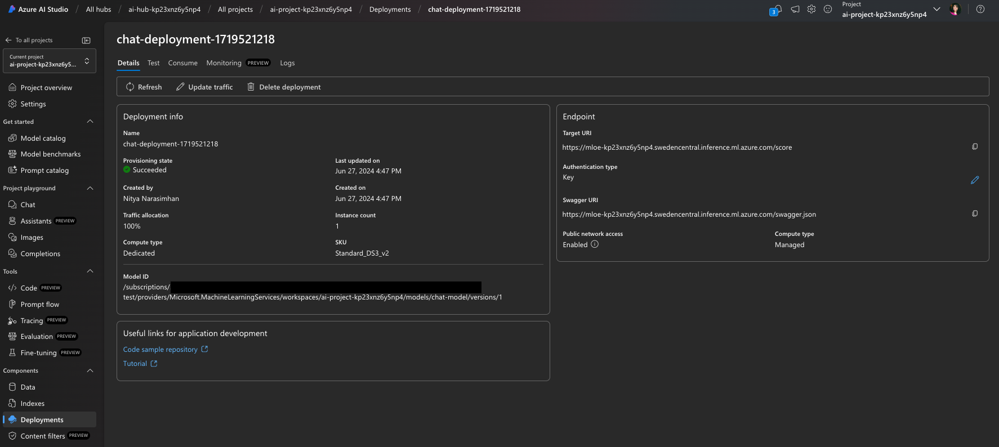
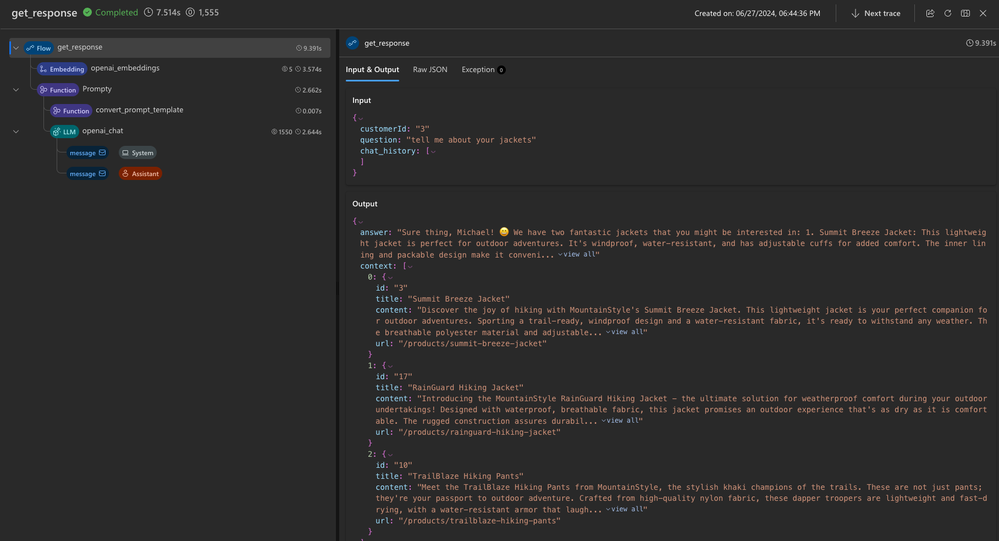

---
lab:
  title: 코드 우선 개발 도구를 사용하여 사용자 지정 Copilot 빌드
---

# 코드 우선 개발 도구를 사용하여 사용자 지정 Copilot 빌드

이 연습에서는 Azure AI 스튜디오의 [AI 프로젝트를 온라인 엔드포인트에 프로비전하고 배포](https://learn.microsoft.com/azure/developer/azure-developer-cli/azure-ai-ml-endpoints?WT.mc_id=academic-140829-cacaste)하는 Azure Developer CLI 템플릿을 복제하고 배포합니다. 그런 다음 이를 시작점으로 사용하여 Azure AI 및 코드 우선 환경을 통해 사용자 지정 Copilot을 빌드합니다.

이 연습은 약 **90**분 정도 소요됩니다.

## 시작하기 전에

이 연습을 완료하려면 다음이 필요합니다.

- GitHub 계정으로 프로젝트 리포지토리를 포크하고 GitHub Codespaces 환경에서 테스트합니다. [GitHub에서](https://github.com/) 무료 계정을 만듭니다.
- 의미 체계 순위매기기를 활성화하기 위한 Azure AI Search의 기본 계층입니다. [AI Search의 가격 책정 세부 정보](https://azure.microsoft.com/pricing/details/search/)에 대해 자세히 알아봅니다.
- 세 개의 OpenAI 모델(`gpt-35-turbo`, `gpt-4`, `text-embedding-ada-002`) 배포 모델을 배포하려면 할당량이 충분한 지역에 AI 허브를 만들어야 합니다. [모델 하위 지역 가용성](https://learn.microsoft.com/azure/ai-services/openai/concepts/models?WT.mc_id=academic-140829-cacaste#model-summary-table-and-region-availability)에 대해 자세히 알아봅니다.

## 시나리오 이해

Azure Developer CLI AI 프로젝트 템플릿을 시작하려면 [Azure Developer CLI 컬렉션을 사용하여 Azure AI 템플릿](https://learn.microsoft.com/collections/5pq0uompdgje8d/?WT.mc_id=academic-140829-cacaste)으로 이동합니다. 컬렉션을 탐색하면 다중 모달 및 다중 에이전트 프로젝트 샘플, Copilot과 같은 프로젝트 및 다양한 프레임워크와 Azure 서비스를 통합하는 샘플을 포함하여 기술 및 사용 사례별로 그룹화된 여러 프로젝트를 찾을 수 있습니다.

이 연습에서는 **[Contoso Chat Retail Copilot과 Azure AI 스튜디오 및 PromptFlow(Python)](https://aka.ms/contoso-retail-sample)** 프로젝트 템플릿을 시작점으로 사용합니다. 이 프로젝트 템플릿은 Prompty 및 PromptFlow를 사용하여 Contoso Outdoors라는 가상 회사의 소매 웹 사이트(채팅 UI)에 통합할 수 있는 사용자 지정 Copilot(채팅 AI)을 빌드하는 코드 우선 환경입니다.


Retail Copilot 솔루션은 RAG(검색 증강 생성) 패턴을 사용하여 회사의 제품 및 고객 데이터에 대한 응답을 기반으로 합니다. 고객은 Retail chatbot에 회사의 제품 카탈로그에 대해 질문하고 이전 구매에 따라 권장 사항을 확인할 수 있습니다.

컬렉션에 포함된 프로젝트 링크를 선택하면 템플릿 코드를 호스팅하는 GitHub 리포지토리로 리디렉션됩니다. 리포지토리의 [README.md](https://github.com/Azure-Samples/contoso-chat/blob/main/README.md) 파일은 아키텍처, 필수 구성 요소 및 프로젝트를 배포하는 단계를 포함하여 프로젝트에 대한 자세한 설명을 제공합니다.


## GitHub Codespaces 설정

이 연습에서는 한 번의 클릭으로 리포지토리에서 직접 미리 구성된 클라우드 호스팅 [개발 컨테이너](https://docs.github.com/codespaces/setting-up-your-project-for-codespaces/adding-a-dev-container-configuration/introduction-to-dev-containers)를 시작할 수 있는 GitHub 기능인 [GitHub Codespaces](https://github.com/features/codespaces)를 사용합니다. 이렇게 하면 Codespaces에 필요한 모든 도구와 종속성이 미리 설치되어 있으므로 로컬 개발 환경을 설정하지 않고도 코딩을 빠르게 시작할 수 있습니다.

개발 환경을 초기화하려면 다음 단계를 수행합니다.

1. **contoso-chat** 리포지토리로 이동합니다.`https://github.com/Azure-Samples/contoso-chat`
1. contoso-chat GitHub 리포지토리 페이지의 오른쪽 위에 있는 **포크** 단추를 선택하여 GitHub 계정에 리포지토리의 복사본을 만듭니다.
1. 포크된 리포지토리가 있으면 **코드** 버튼을 선택하고 **Codespaces**를 선택합니다.
1. **+** 버튼을 선택하여 포크된 리포지토리의 기본 분기에 새 codespace를 만듭니다.

    

1. 몇 초 후에 Codespaces 환경이 기본적으로 [연결된 Visual Studio Code 편집기](https://code.visualstudio.com/docs/devcontainers/containers)를 사용하여 설정되는 새 브라우저 탭으로 리디렉션됩니다.

## AZURE에 VS Code 환경 연결

다음 단계는 프로젝트를 배포하려는 Azure 구독과 개발 환경을 연결하는 작업입니다. 먼저 Codespaces에서 실행되는 VS Code 환경에서 새 터미널을 엽니다.

1. [최신 버전](https://github.com/Azure/azure-dev/releases/tag/azure-dev-cli_1.9.3)의 Azure Developer CLI가 설치되어 있는지 확인합니다.
    ```bash
    azd version
    ```

1. 다음으로 VS Code 터미널에서 Azure 계정에 로그인합니다.

    ```bash
    azd auth login 
    ```

## 프로젝트에 대한 Azure 리소스 프로비전

로그인하면 구독에서 프로젝트에 대한 Azure 리소스 프로비저닝을 시작할 준비가 된 것입니다. 로그인에 사용한 것과 동일한 VS Code 터미널에서 이 작업을 수행할 수 있습니다.

1. azd를 사용하여 AI 애플리케이션을 프로비전하고 *배포*합니다.

    ```bash
    azd up
    ```

1. 다음과 같은 프롬프트가 표시됩니다. 아래 지침을 사용하여 응답합니다.
    - **새 환경 이름 입력:** *리소스 그룹 이름을 만드는 데 사용됩니다.*
    - **사용할 Azure 구독 선택**: *Azure OpenAI 모델에 대한 액세스 권한이 있는 구독을 선택합니다.*
    - **사용할 Azure 위치 선택**: *사용 가능한 모델 할당량이 있는 위치를 선택합니다*.

    > [모델 요약 테이블 및 지역 가용성](https://learn.microsoft.com/en-us/azure/ai-services/openai/concepts/models?WT.mc_id=academic-140829-cacaste#model-summary-table-and-region-availability)을 사용하여 필요한 지역을 찾습니다. 예를 들어 대부분의 `sweden central`는 Azure OpenAI 모델을 사용할 수 있는 지역이므로 Azure 위치로 사용할 수 있습니다.

## Azure Portal을 사용하여 프로비저닝 유효성 검사

azd를 사용하여 AI 애플리케이션을 프로비전하고 배포하는 작업은 완료하는 데 10분 이상 걸릴 수 있습니다. 다음을 통해 진행률을 추적할 수 있습니다.

- [Azure Portal](https://ms.portal.azure.com/)에서 자세한 진행률을 확인합니다. 환경 이름에 해당하는 리소스 그룹을 검색합니다. 사이드바에서 **배포** 옵션을 선택한 다음, 생성되는 리소스의 배포 상태를 모니터링합니다.
- [Azure AI Studio](https://ai.azure.com) 포털을 방문합니다. Azure AD 계정을 사용하여 로그인합니다. 위의 리소스 그룹에 해당하는 AI 허브를 검색합니다(몇 번 새로 고쳐야 할 수도 있음). 나열된 AI 프로젝트를 선택한 다음, 사이드바에서 **배포**를 선택하여 모델 및 채팅 애플리케이션 배포의 상태를 추적합니다.

Azure Portal을 사용하여 리소스 프로비전의 유효성을 검사하는 방법을 살펴보겠습니다.

1. 브라우저에서 [Azure Portal](https://ms.portal.azure.com/)로 이동합니다.
1. 로그인하고 이전에 입력한 구독 및 환경 이름에 해당하는 리소스 그룹을 찾습니다. **개요** 패널은 다음과 같습니다.

    

1. 먼저 주요 [Azure AI 스튜디오 아키텍처](https://learn.microsoft.com/azure/ai-studio/concepts/architecture) 리소스가 생성되었는지 확인해 보겠습니다. 아래 그림에서는 이러한 각 리소스가 AI 애플리케이션에 제공하는 내용에 대한 자세한 내용을 제공합니다.

    - **Azure AI 허브**: 최상위 Azure 리소스입니다. 팀을 위한 공동 작업 환경을 제공합니다.
    - **Azure AI 프로젝트**: 허브의 자식입니다. 오케스트레이션, 사용자 지정을 위해 앱 구성 요소를 그룹화합니다.
    - **Azure AI 서비스**: 모델 엔드포인트를 관리합니다.

    

1. 다음으로, 쿼리 기반 검색을 위해 제품 및 고객 데이터를 저장하여 [검색 증강 생성](https://learn.microsoft.com/azure/ai-studio/concepts/retrieval-augmented-generation) 디자인 패턴을 구현하기 위한 두 가지 주요 리소스를 프로비전했는지 확인해 보겠습니다.

    - **검색 서비스**: 제품 카탈로그 데이터에 대한 검색 인덱스를 관리합니다.
    - **Azure Cosmos DB 계정**: 고객 주문 데이터에 대한 데이터베이스를 만듭니다.

1. 다음으로, AI 애플리케이션 요구 사항을 관리하기 위한 지원 리소스가 있는지 확인할 수 있습니다.

    - **Application Insights**: 배포된 애플리케이션에 대한 모니터링 및 원격 분석을 지원합니다.
    - **Container Registry**: 프로젝트에 사용되는 Docker 이미지를 비공개로 저장하고 관리합니다.
    - **키 자격 증명 모음**: 프로젝트 비밀(키, 자격 증명)을 안전하게 저장합니다.
    - **스토리지 계정**: AI 프로젝트 관리(로그 포함)와 관련된 데이터를 저장합니다.
    - **스마트 탐지기 경고 규칙**: Application Insights Anomaly Detector(요청의 경우).

1. 마지막으로 **Machine Learning 온라인 배포** 유형이 있는 새 리소스를 확인할 수 있습니다. 이는 배포된 Azure AI 프로젝트 엔드포인트(채팅 Copilot용)에 해당하는 리소스입니다.

## Azure AI 스튜디오를 사용하여 배포 유효성 검사

Azure Portal을 사용하면 프로젝트의 기본 Azure 리소스를 관리할 수 있습니다. Azure AI Studio 포털을 사용하면 모델 선택에서 애플리케이션 배포에 이르기까지 AI 프로젝트 자체를 엔드투엔드로 *빌드하고 관리*할 수 있습니다. `azd up` 명령은 필수 모델 프로비저닝부터 사용을 위한 Copilot API 엔드포인트 배포 및 호스팅까지 전체 프로세스를 완료해야 합니다. 애플리케이션이 예상대로 작동하는지 확인해 보겠습니다.

1. 구독의 모든 Azure AI 허브를 보려면 [Azure AI 스튜디오](https://ai.azure.com/manage)의 **관리** 페이지를 방문하세요.
1. 리소스 그룹의 허브를 선택하여 리소스 그룹 내 모든 Azure AI 프로젝트를 봅니다.
1. 허브에서 기본 AI 프로젝트를 선택한 다음 왼쪽 메뉴에서 **배포**를 선택합니다.
1. **모델 배포**에서 다음 배포를 포함하여 Azure OpenAI 연결이 있는지 확인합니다.
    - **gpt-35-turbo**: 채팅 완료에 사용되며 핵심 채팅 엔진을 구성합니다.
    - **gpt-4**: 채팅 평가, 특히 AI 지원 흐름에 사용됩니다.
    - **text-embedding-ada-002**: 쿼리 벡터화 및 검색에 사용됩니다.
1. 다음을 사용하여 Machine Learning 온라인 엔드포인트가 있는지 확인합니다.
    - **chat-model**: *mloe-xxx* 엔드포인트 리소스를 사용한 채팅 AI 배포.

    

## Azure AI Studio를 사용하여(클라우드에서) 배포 테스트

배포된 Copilot 작동의 유효성을 검사하려면 Azure AI 스튜디오에서 기본 제공 테스트 플레이그라운드 기능을 사용합니다.



1. Azure AI 스튜디오의 **앱 배포** 목록에서 **chat-deployment-xxxx** 배포를 선택합니다.
1. 배포된 채팅 애플리케이션의 **세부 정보** 페이지에서 **테스트** 탭을 선택하여 테스트 인터페이스를 가져옵니다.

    **세부 정보** 탭에는 실제 사용자 상호 작용을 위해 이 채팅 도우미를 통합하기 위해 다른 프런트 엔드 애플리케이션(예: Contoso Outdoor 웹 사이트)과 함께 사용할 수 있는 `Target URI` 및 `Key` 값도 있습니다.

1. 이제 다음 테스트 **입력**을 사용하여 Copilot 배포를 테스트합니다.

    ```bash
    {"question": "tell me about your hiking shoes", "customerId": "2", "chat_history": []}
    ```

표시된 대로 출력 구성 요소에서 유효한 JSON 응답을 가져와야 합니다.


## Visual Studio Code를 사용하여 배포 테스트(로컬)

**azd up** 명령은 애플리케이션을 프로비전하고 Azure에 배포할 뿐만 아니라 로컬 개발, 테스트 및 반복을 지원하도록 Visual Studio Code에서 *로컬 환경을 구성*합니다. 이를 확인해 보겠습니다.

1. 먼저 VS Code 환경이 올바르게 설정되었는지 확인합니다. 루트 폴더에서 **config.json** 파일을 검색하고 유효한 값을 사용하여 아래에 정의된 세 가지 속성이 있는지 확인합니다.

    ```json
    {
        "subscription_id": "xxxxxxxxxxxxxxxx",
        "resource_group": "rg-xxxxxx",
        "workspace_name": "ai-project-xxxxxxx"
    }

    ```

1. 루트 폴더에 **.env** 파일이 생성되었는지 확인합니다. *값이 채워진* 환경 변수 목록이 포함되어야 합니다.

    ```bash
    AZUREAI_HUB_NAME=
    AZUREAI_PROJECT_NAME=
    AZURE_CONTAINER_REGISTRY_ENDPOINT=
    AZURE_CONTAINER_REGISTRY_NAME=
    AZURE_COSMOS_NAME=
    AZURE_ENV_NAME=
    AZURE_KEY_VAULT_ENDPOINT=
    AZURE_KEY_VAULT_NAME=
    AZURE_LOCATION=
    AZURE_OPENAI_API_VERSION=
    AZURE_OPENAI_CHAT_DEPLOYMENT=
    AZURE_OPENAI_ENDPOINT=
    AZURE_OPENAI_NAME=
    AZURE_RESOURCE_GROUP=
    AZURE_SEARCH_ENDPOINT=
    AZURE_SEARCH_NAME=
    AZURE_SUBSCRIPTION_ID=
    AZURE_TENANT_ID=
    COSMOS_ENDPOINT=
    ```

1. 개발 환경에 **Promptflow 도구**가 설치되어 있는지 확인합니다.

    ```bash
    pf version
    ```

1. **pf 흐름 테스트** 도구를 사용하여 아래 샘플 질문과 함께 **contoso_chat** flex 흐름 애플리케이션을 로컬로 테스트합니다. 입력을 전달하기 위한 명령의 구문을 확인합니다.

    ```bash
    pf flow test --flow ./contoso_chat --inputs question="tell me about your jackets" customerId="3" chat_history=[]
    ```

다음과 같은 응답을 받아야 합니다.


### Visual Studio Code를 사용하여 추적 보기(로컬)

1. 아래와 같이 `--ui` 플래그를 사용하여 실행 세부 정보를 추적할 수 있습니다.

    ```bash
    pf flow test --flow ./contoso_chat --inputs question="tell me about your jackets" customerId="3" chat_history=[] --ui
    ```

이 명령은 대기 시간 및 토큰 사용을 포함하여 해당 테스트 실행에 대한 개략적인 세부 정보를 제공하는 테이블이 있는 새 탭의 브라우저에서 **추적 보기**를 시작해야 합니다.


1. 레코드를 선택하여 원시 데이터(입력, 출력)에서 흐름의 개별 단계 및 관련 구성 요소(예: LLM에 사용되는 프롬프트 템플릿)에 이르기까지 흐름의 세부 정보를 보다 세부적으로 검사할 수 있는 더 자세한 추적 보기로 확장합니다.



## Contoso Chat 코드베이스 이해

Azure 백 엔드가 프로비전되고 준비됩니다. 로컬 개발 환경이 설정되고 Azure 백 엔드에서 작동하도록 구성됩니다. 이제 고유한 버전의 애플리케이션을 사용자 지정하고 다시 배포하기 위해 콘텐츠를 수정하기만 하면 됩니다. 코드베이스가 구성되는 방법에 대해 간단히 살펴보겠습니다.

> 이는 리포지토리의 **간소화된 목록**으로, 명확성을 위해 일부 파일 및 폴더를 제거합니다.

```bash
data/
    customer_info/  
        create-cosmos-db.ipynb      # Run notebook to upload data to Cosmos DB
        customer_info_1.json        # Example Customer info and orders file
        customer_info_2.json 
        ...
        ...
    product_info/   
        create-azure-search.ipynb   # Run notebook to index product data in AI Search
        products.csv                # Example Products data file

contoso_chat/                       # Main folder for application content
    ai_search.py                    # Search retrieval tool (for RAG design)
    chat.json                       # Example chat file (for Prompty template)
    chat.prompty                    # Chat asset (using Prompty format)
    chat_request.py                 # LLM request tool (for chat completion)
    flow.flex.yaml                  # Promptflow flex flow (define entry point)
    requirements.txt                # App dependencies (define runtime environment)

azure.yaml                          # Main configuration file for Azure Developer CLI  
infra/      
    ai.yaml                         # Define AI model deployments
    app/                            # Infrastructure-as-code config specific to app
    core/                           # Infrastructure-as-code config for core resources
    hooks/                          # Contains post-provisioning scripts
    main.bicep                      # Entry point for Bicep template used by azd
deployment/                         # ai.endpoint config files (named in azure.yaml)
    chat-deployment.yaml 
    chat-model.yaml  
    environment.yaml  

requirements.txt
```

코드를 사용자 지정하려는 경우:

- `contoso_chat/`에서 앱을 변경하려면 `azd deploy`를 실행하여 애플리케이션을 이전에 프로비전된 백 엔드에 다시 배포하기만 하면 됩니다. 추가 다시 프로비저닝 또는 수동 개입 단계가 필요하지 않습니다.
- `infra/` 폴더에서 리소스를 변경한 경우 `azd up`을 실행하여 애플리케이션을 다시 프로비전하고 다시 배포합니다. 이전 구성 값을 `.azure/`에서 자동으로 선택하고 수정해야 합니다.

## 선택 사항: Copilot 사용자 지정 및 다시 배포

사용자 지정 Copilot을 구축할 때입니다. 다음은 이를 시험해 보기 위해 탐색할 수 있는 몇 가지 사항입니다.

다음 각 옵션에 주의하세요.

- 앱 코드만 변경한 경우 `azd deploy`를 사용하여 애플리케이션을 다시 배포합니다.
- 리소스 구성을 변경한 경우 `azd up`을 사용하여 애플리케이션을 다시 프로비전하고 다시 배포합니다.

### 고객 및 주문 기록 데이터 사용자 지정

1. **data/customer_info** 아래의 샘플 데이터를 검토하여 기본 스키마를 파악합니다.
1. 데이터 업데이트에 대한 코드 우선 접근 방식은 **data/create-cosmos-db.ipynb** Notebook을 살펴봅니다.
1. 샘플 데이터를 **수정**하고 Notebook을 **실행**하여 기본 Azure CosmosDB 데이터베이스를 변경합니다.
1. 앱을 **다시 배포**합니다. 테스트 질문을 시도하여 새 고객 데이터가 반환되는지 확인합니다.

### 제품 카탈로그 데이터 사용자 지정

1. **data/product_info/** 에서 샘플 데이터를 검토하여 기본 스키마를 파악합니다.
1. 인덱스 업데이트에 대한 코드 우선 접근 방식은 **create-azure-search.ipynb** Notebook을 살펴봅니다.
1. 샘플 데이터를 **수정**하고 Notebook을 **실행**하여 기본 Azure AI Search 인덱스를 변경합니다.
1. 앱을 **다시 배포**합니다. 테스트 질문을 시도하여 새 제품 데이터가 반환되는지 확인합니다.

### 프롬프트 템플릿 사용자 지정

1. **contoso_chat/chat.prompty** 파일을 검토하여 기본 프롬프트 템플릿을 파악합니다.
1. **contoso_chat/chat.json**을 검토하여 테스트용 샘플 데이터 스키마를 이해합니다.
1. 템플릿(시스템 메시지, 안전성, 설명서 또는 지침)을 **수정**합니다.
1. 필요한 경우 예제 데이터를 **수정**합니다.
1. Promptflow CLI를 **사용**하여 새 프롬프트 템플릿을 통해 흐름을 로컬로 테스트합니다.
1. 프롬프트 확장을 **설치하고 사용**하여 처음부터 새 프롬프트 템플릿을 만듭니다.

### 평가 및 파이프라인 자동화 살펴보기

GitHub Actions를 통해 앱 평가 파이프라인을 실행하는 데 사용되는 테스트 데이터 세트를 사용자 고유의 데이터로 바꿉니다. 테스트 데이터 세트는 프로젝트의 **데이터** 폴더에 있으며 .**jsonl** 형식입니다.

1. 테스트 데이터 세트 파일을 사용자 고유의 데이터로 바꿉니다.
1. 그런 다음, 포크된 리포지토리의 기본 분기에 변경 내용을 푸시하여 평가 파이프라인을 실행합니다.

    평가 파이프라인이 자동으로 실행되고 리포지토리의 GitHub Actions 탭에서 결과를 확인할 수 있습니다.

1. 프로젝트의 **.github/workflows** 폴더에서 **evaluate.yaml** 파일을 수정하고 **평가** 폴더의 **evaluations_chat.py** 스크립트를 수정하여 평가 파이프라인을 사용자 지정할 수 있습니다.

## Azure 리소스 정리 및 삭제

이 프로젝트는 장기간 실행될 경우 사소한 비용이 발생할 수 있는 모델 및 서비스(예: Azure AI Search)를 사용합니다. Azure AI AZD 템플릿 탐색을 마치면 불필요한 Azure 비용을 피하기 위해 생성한 리소스를 삭제해야 합니다. VS Code 터미널에서 다음 명령을 실행하여 이 작업을 수행할 수 있습니다.

```bash
azd down
```

이렇게 하면 애플리케이션을 프로비전하고 배포하는 단계를 되돌릴 뿐만 아니라 "일시 삭제" 상태로 유지될 수 있는 리소스를 *제거*하는 추가 단계가 수행되어 리소스 이름을 다시 사용하거나 모델 할당량을 회수하는 기능에 영향을 줍니다. **이 명령은 종료 중에 이러한 작업에 대해 묻는 메시지를 표시하므로 올바르게 응답해야 합니다.**
